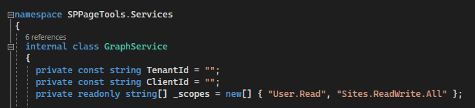
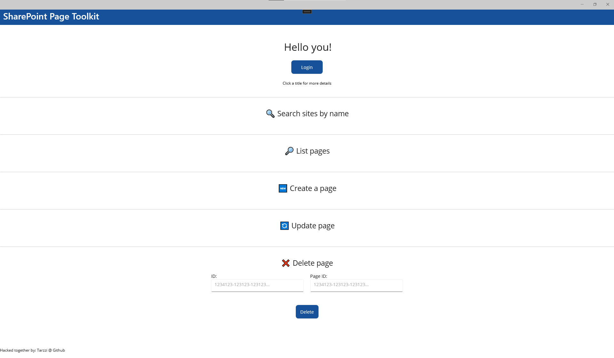
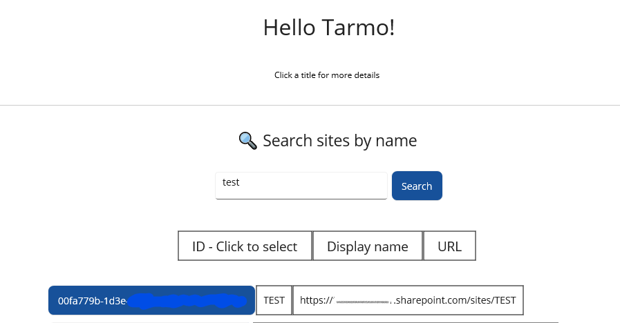
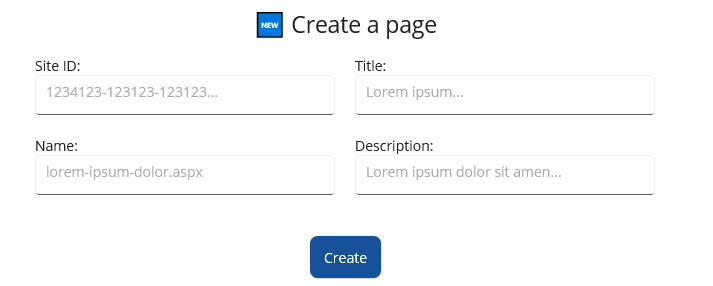
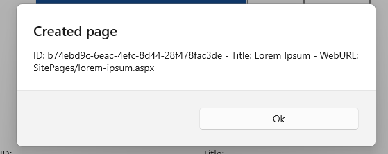
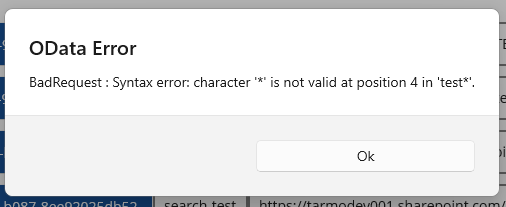

# SharePoint page toolkit
  

## What is this?
This is my submission as part of the hackathon!  
A simple SharePoint page toolkit with .NET MAUI and Graph API  🦒, that allows an admin to leverage Graph API for quick basic SharePoint page CRUD operations. 

## Supported platforms
Currently tested/working only on Windows platform, due to limited time and resources

## Pre-Requirements
1. Create an AAD app registration with permissions:  
- User.Read
- Sites.ReadWrite.All

2. Save your Tenant ID and app Client ID  

## To run it
1. Clone repo
2. Open in Visual Studio
3. Install required packages
4. Add your Tenant ID and app registration's client ID to GraphService.cs file

5. Run the project

## What can I do with it?
- Get name of the logged in user
- Search SharePoint sites
- List pages on a selected site
- Create a page
- Update a page
- Delete a page

## How does it look?
### General layout
 
### Search for sites
 
 ### Options to create
 
### Prompts for success
 
 ### And prompts for failure
 
